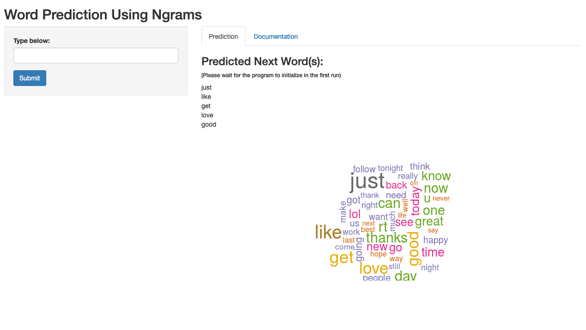

Word Prediction Application
========================================================
author: Yigit Ozan Berk
date: December 2019
autosize: true

This presentation is about an application for next word prediction using ngrams created for the Coursera Capstone project for the data science specialization.

The Data
========================================================

- For training the algorithm, various posts on twitter, blogs, and news articles were provided. Due to memory restrictions, only a large part of twitter posts were used in the final model. For the complete dataset you can visit this link:
<https://d396qusza40orc.cloudfront.net/dsscapstone/dataset/Coursera-SwiftKey.zip>.

- 'Quanteda' package was used in order to process and utilize given texts. To clean the data for further use the text was transformed to corpus object, the words were turned to lowercase, numbers were removed, punctuations were removed.

- To use the cleaned raw data, data-feature matrices were created with observed unigrams, bigrams and trigrams with corresponding frequencies.

The Algorithm
========================================================
- The user enters text into input field, and clicks submit to put out a top 5 predicted next words list, and a wordcloud on most probable next words based on the input.
- The algorithm used is Stupid Back-off algorithm: the algorithm takes the input, and if the ngram is observed it is printed, if not, it outputs (n-1)gram with 0.4 probability penalty multiplier. 
- The model was selected for simplicity and performance. The app predicts the next word in an average of 3-4 seconds. The raw data was extracted from 300,000 lines of twitter texts. The first initialization takes around 9 seconds.

Slide With Plot
========================================================

- For further reading on performance related comparisons of Stupid backoff algorithm you can visit this link:
<https://www.aclweb.org/anthology/D07-1090.pdf>.

- Please try out the app:
<https://yoberk.shinyapps.io/mypred/>.

- You can find the ui.R and server.R codes below:
<https://github.com/yigitozanberk/capstone/blob/master/NLP/ui.R>
<https://github.com/yigitozanberk/capstone/blob/master/NLP/server.R>

